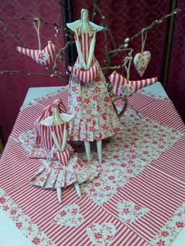
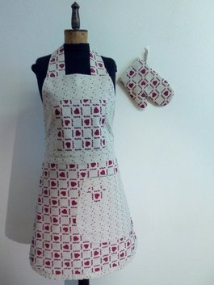
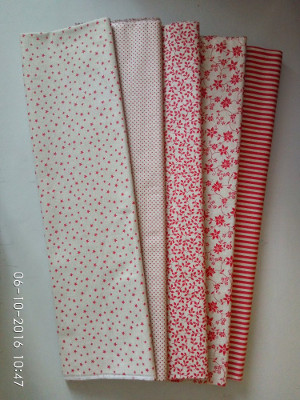
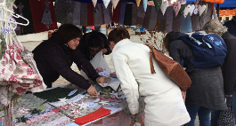

    

    
    

            <h1>Srdečně Vás vítám v mé malé galerii.</h1>
            <h3>Líbí se Vám? Ráda pro Vás něco podobného ušiju.</h3>
    

    

        
        <h3><a href="/ubrusy.html">Kombinace s ubrusem</a></h3>
    

    

        
        <h3><a href="/zastery.html">Kombinace se zástěrou</a></h3>
    

    

        
        <h3><a href="/vzornik.html">Vzorník</a></h3>
    

    

        
        

            <h3>Zde mě můžete potkat:</h3> 
            <h4>01.04. Toulcův dvůr, Praha</h4>
            <h4>08.04. Nymburk</h4>
            <h4>09.04. Sychrov</h4>
            <h4>15.04. Dlaskův statek, Dolánky</h4>
        

    

    

    
